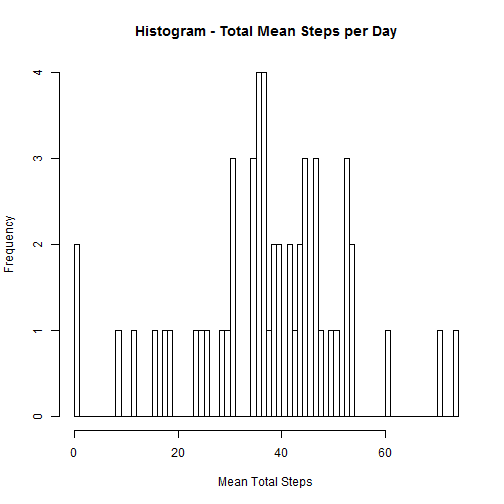

Loading and preprocessing the data


```r
#1. Load the data, the csv MUST exist in your current working directory
setwd("C:/Users/IBM_ADMIN/Desktop/R/Repdata_data_activity/")
file ="activity.csv"
actvitydf <- read.csv(file,stringsAsFactors=FALSE)

#2. Process/transform the data 
#Remove NA values
actvitydfCC <- actvitydf[complete.cases(actvitydf),]
#print total rows -no NA records included
nrow(actvitydfCC)
```

```
## [1] 15264
```

```r
#convert to data table
actvitydt <- data.table(actvitydfCC)
#print top 6 records
head(actvitydt)
```

```
##    steps       date interval
## 1:     0 2012-10-02        0
## 2:     0 2012-10-02        5
## 3:     0 2012-10-02       10
## 4:     0 2012-10-02       15
## 5:     0 2012-10-02       20
## 6:     0 2012-10-02       25
```

What is mean total number of steps taken per day?


```r
#1. Calculate the total number of steps taken per day
steps_per_day <-  aggregate(actvitydt$steps, 
                            by=list(actvitydt$date),
                            na.rm=TRUE,
                            FUN=mean)
setnames(steps_per_day, c("date","total_steps"))

#2. Make a histogram of the total number of steps taken each day
# calculate # of breaks
brk = nrow(steps_per_day)
# Update date format to Date/POSIXct
steps_per_day$date <- as.POSIXct(steps_per_day$date,
                                  format = "%Y-%m-%d")
# draw a histogram
hist(steps_per_day$total_steps,
     xlab="Mean Total Steps",
     breaks=brk,
     main="Histogram - Total Mean Steps per Day" )
```

 

```r
#3. Calculate and report the mean and median of the total number of steps taken per day
# mean of steps per day
steps_per_day_mean <-  aggregate(steps_per_day$total_steps, by=list(steps_per_day$date),
                            FUN=mean)
setnames(steps_per_day_mean, c("date", "mean_steps_per_day"))
# print top 6 rows
head(steps_per_day_mean)
```

```
##         date mean_steps_per_day
## 1 2012-10-02            0.43750
## 2 2012-10-03           39.41667
## 3 2012-10-04           42.06944
## 4 2012-10-05           46.15972
## 5 2012-10-06           53.54167
## 6 2012-10-07           38.24653
```

```r
# median of steps per day
steps_per_day_median <-  aggregate(steps_per_day$total_steps, by=list(steps_per_day$date),
                                 FUN=median)
setnames(steps_per_day_median, c("date", "median_steps_per_day"))
# print top 6 rows
head(steps_per_day_median)
```

```
##         date median_steps_per_day
## 1 2012-10-02              0.43750
## 2 2012-10-03             39.41667
## 3 2012-10-04             42.06944
## 4 2012-10-05             46.15972
## 5 2012-10-06             53.54167
## 6 2012-10-07             38.24653
```

What is the average daily activity pattern?

```r
#1. Make a time series plot of the 5-minute interval (x-axis) and 
#   the average number of steps taken, averaged across all days (y-axis)

# get avg per interval
avg_per_5_min <-  aggregate(actvitydt$steps, 
                            by=list(actvitydt$interval),
                            FUN=mean)
setnames(avg_per_5_min, c("Interval", "Average"))

#plot the average daily activity pattern
plot(avg_per_5_min$Interval, avg_per_5_min$Average,
     pch=".",xlab="Interval",ylab="Average Steps",
     main="Average Daily Activity Pattern",type="n")
lines(avg_per_5_min$Interval, avg_per_5_min$Average)

#2. Which 5-minute interval, on average across all the days in the dataset, 
#   contains the maximum number of steps?
# find max average
amax<- max(avg_per_5_min$Average)
# find row that has max average
row <- which(grepl(amax,avg_per_5_min$Average))
row <- avg_per_5_min[row,]
# plot the point max average
points(row[[1]],row[[2]], col="red")

# plot the range within which the max average falls
rect(xleft=row[[1]]-3,
     xright=row[[1]]+3,
     ybottom=-row[[2]], ytop=row[[2]], col="lightgrey")

#plot the interval (series) on x axis
series <- ts(avg_per_5_min$Interval)
axis(1, series)
```

 

Imputing missing values

```r
#1. Calculate and report the total number of missing values in the dataset
totalNA <- nrow(actvitydf) - nrow(actvitydf[complete.cases(actvitydf),])
#print total number of NA entries
totalNA
```

```
## [1] 2304
```

```r
#2. Devise a strategy for filling in all of the missing values in the dataset
# impute steps - NA with 'mean' value
row_before_imputing <- nrow(actvitydf)
# print the total rows prior to imputing
row_before_imputing
```

```
## [1] 17568
```

```r
#add a new column with imputed values for steps that had NA records
#using total mean for imputing
actvitydf$imputed_steps <- with(actvitydf, impute(steps, mean))

# print the total rows post imputing
row_after_imputing <- nrow(actvitydf)
row_after_imputing
```

```
## [1] 17568
```

```r
#print the imputed data set
head(actvitydf)
```

```
##   steps       date interval imputed_steps
## 1    NA 2012-10-01        0       37.3826
## 2    NA 2012-10-01        5       37.3826
## 3    NA 2012-10-01       10       37.3826
## 4    NA 2012-10-01       15       37.3826
## 5    NA 2012-10-01       20       37.3826
## 6    NA 2012-10-01       25       37.3826
```

```r
#3. Create a new dataset that is equal to the original dataset but with the missing data filled in
new_dataset <- select(data.table(actvitydf), imputed_steps,date,interval)
new_dataset$date <- as.POSIXct(new_dataset$date,
                               format = "%Y-%m-%d")
setnames(new_dataset, c("steps", "date","interval"))
#print top 6 records
head(new_dataset)
```

```
##      steps       date interval
## 1: 37.3826 2012-10-01        0
## 2: 37.3826 2012-10-01        5
## 3: 37.3826 2012-10-01       10
## 4: 37.3826 2012-10-01       15
## 5: 37.3826 2012-10-01       20
## 6: 37.3826 2012-10-01       25
```

```r
#4. Make a histogram of the total number of steps taken each day and 
#   Calculate and report the mean and median total number of steps taken per day
steps_per_day_new_dataset <-  aggregate(new_dataset$steps, 
                                        by=list(new_dataset$date),
                                        FUN=sum)
setnames(steps_per_day_new_dataset, c("date","total_steps"))
brk = nrow(steps_per_day_new_dataset)

#plot the histogram
hist(steps_per_day_new_dataset$total_steps,
     xlab="Total Steps",
     breaks=brk,
     main="Histogram - Total Steps per Day" )
```

 

```r
# calculate the mean, median per day
steps_per_day_new_dataset_mean <- aggregate(steps_per_day_new_dataset$total_steps, 
                                            by=list(steps_per_day_new_dataset$date),
                                            FUN=mean)
setnames(steps_per_day_new_dataset_mean, c("date", "mean_steps_per_day"))
#print top 6 rows
head(steps_per_day_new_dataset_mean)
```

```
##         date mean_steps_per_day
## 1 2012-10-01           10766.19
## 2 2012-10-02             126.00
## 3 2012-10-03           11352.00
## 4 2012-10-04           12116.00
## 5 2012-10-05           13294.00
## 6 2012-10-06           15420.00
```

```r
# calculate the median per day
steps_per_day_new_dataset_median <-  aggregate(steps_per_day_new_dataset$total_steps, 
                                               by=list(steps_per_day_new_dataset$date),
                                               FUN=median)
setnames(steps_per_day_new_dataset_median, c("date", "median_steps_per_day"))
#print top 6 rows
head(steps_per_day_new_dataset_median)
```

```
##         date median_steps_per_day
## 1 2012-10-01             10766.19
## 2 2012-10-02               126.00
## 3 2012-10-03             11352.00
## 4 2012-10-04             12116.00
## 5 2012-10-05             13294.00
## 6 2012-10-06             15420.00
```

```r
#5.a   Do these values differ from the estimates from the first part of the assignment? 
nrow(steps_per_day_new_dataset_mean)
```

```
## [1] 61
```

```r
nrow(steps_per_day_new_dataset_median)
```

```
## [1] 61
```
Question:Do these values differ from the estimates from the first part of the assignment?
Answer: yes,to some extent 
- Previously NA values for 'steps' are not imputed with mean of steps, that impacts the results
- 1 point right shift in Median when median is func used for imputing
- Significant left shift in Mean and Median when 'random' is func used for imputing 

```r
#5.b   What is the impact of imputing missing data on the estimates of the total daily 
#   number of steps?
#mean, median data comparision with/without imputing steps
mean(steps_per_day$total_steps)
```

```
## [1] 37.3826
```

```r
mean(steps_per_day_new_dataset$total_steps)
```

```
## [1] 10766.19
```

```r
median(steps_per_day$total_steps)
```

```
## [1] 37.37847
```

```r
median(steps_per_day_new_dataset$total_steps)
```

```
## [1] 10766.19
```


Are there differences in activity patterns between weekdays and weekends?


```r
#1. Create a new factor variable in the dataset with 
#   two levels - "weekday" and "weekend" indicating whether 
#   a given date is a weekday or weekend day.
new_dataset$day <- weekdays(new_dataset$date)
#add factor (weekday/weekend)
new_dataset$daytype[new_dataset$day=="Saturday" |
                        new_dataset$day=="Sunday" ] <- "Weekend"
new_dataset$daytype[new_dataset$day !="Saturday" &
                        new_dataset$day !="Sunday" ] <- "Weekday"
#print top 6 rows
head(new_dataset)
```

```
##      steps       date interval    day daytype
## 1: 37.3826 2012-10-01        0 Monday Weekday
## 2: 37.3826 2012-10-01        5 Monday Weekday
## 3: 37.3826 2012-10-01       10 Monday Weekday
## 4: 37.3826 2012-10-01       15 Monday Weekday
## 5: 37.3826 2012-10-01       20 Monday Weekday
## 6: 37.3826 2012-10-01       25 Monday Weekday
```

```r
#2. Make a panel plot containing a time series plot of the 5-minute interval (x-axis) 
#   and the average number of steps taken, averaged across all weekday days 
#   or weekend days (y-axis)

#create plot matrix with 2 rows 1 columns
par(mfrow=c(2,1),oma=c(2,2,1,1))

#prepare weekend data 
weekend_data <- subset(new_dataset, new_dataset$daytype == "Weekend")
head(weekend_data)
```

```
##    steps       date interval      day daytype
## 1:     0 2012-10-06        0 Saturday Weekend
## 2:     0 2012-10-06        5 Saturday Weekend
## 3:     0 2012-10-06       10 Saturday Weekend
## 4:     0 2012-10-06       15 Saturday Weekend
## 5:     0 2012-10-06       20 Saturday Weekend
## 6:     0 2012-10-06       25 Saturday Weekend
```

```r
weekend_data_avg <-  aggregate(weekend_data$steps, 
                               by=list(weekend_data$interval),
                               FUN=mean)
setnames(weekend_data_avg, c("Interval", "AvgSteps"))

#plot time series for weekend data
series <- ts(weekend_data_avg$Interval)
plot.ts(series, weekend_data_avg$AvgSteps,
        xaxt="n",ylab="",xlab="",pch=".")
lines(weekend_data_avg$Interval, weekend_data_avg$AvgSteps)
mtext("weekend",3)
       
# prepare weekday data
weekday_data <- subset(new_dataset, new_dataset$daytype == "Weekday")
head(weekday_data)
```

```
##      steps       date interval    day daytype
## 1: 37.3826 2012-10-01        0 Monday Weekday
## 2: 37.3826 2012-10-01        5 Monday Weekday
## 3: 37.3826 2012-10-01       10 Monday Weekday
## 4: 37.3826 2012-10-01       15 Monday Weekday
## 5: 37.3826 2012-10-01       20 Monday Weekday
## 6: 37.3826 2012-10-01       25 Monday Weekday
```

```r
weekday_data_avg <-  aggregate(weekday_data$steps, 
                                             by=list(weekday_data$interval),
                                             FUN=mean)

setnames(weekday_data_avg, c("Interval", "AvgSteps"))

#plot time series for weekday data
series <- ts(weekday_data_avg$Interval)
plot(series, weekday_data_avg$AvgSteps,
     ylab="",xlab="",pch=".")
lines(weekday_data_avg$Interval, weekday_data_avg$AvgSteps)
mtext("weekday",3)

#add yaix lable, to the outer margin
mtext("Interval",side=1,outer=TRUE)
mtext("Number of steps",side=2,outer=TRUE)
```

 
